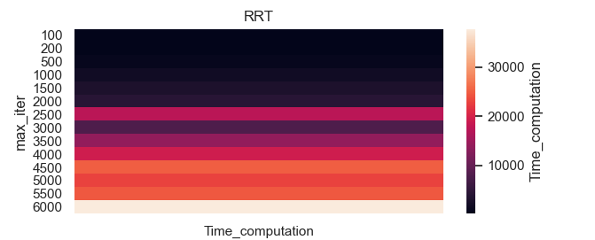
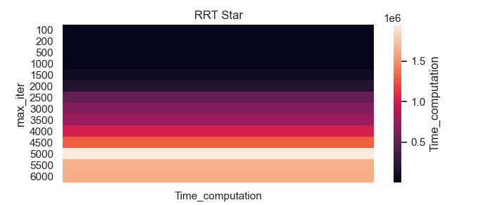

# Path-planning-using-RRT
We present here, the different results and code created during practical work Planning Path using RTT.
A report is available while asking for an access to khalid.oublal@polytechnique.edu 

### Time complexity for RRT


### Time complexity for RRT*



### Implementation of a simple variant of the OBRRT [(see paper)](docs/CONTRIBUTING.md)
In this algorithm, the idea is to sample points taking into account the obstacles in order to
increase the chances that the tree passes through difficult areas.

```
    def generate_random_node(self, goal_sample_rate):
          if np.random.random() < goal_sample_rate:
              return self.s_goal

          delta = self.utils.delta

          node = Node((np.random.uniform(self.x_range[0] + delta, self.x_range[1] - delta),
                      np.random.uniform(self.y_range[0] + delta, self.y_range[1] - delta)))

          if np.random.randn() < 0.6:
              while 1:
                  id = np.random.randint(len(self.env.obs_rectangle))
                  #[x, y, w, h] = self.env.obs_rectangle[id]
                  # We can use directly self.env.obs_rectangle[id][index]
                  node_list =[Node((np.random.uniform(self.env.obs_rectangle[id][0] - delta, self.env.obs_rectangle[id][0] + delta),
                                     np.random.uniform(self.env.obs_rectangle[id][1] - delta, self.env.obs_rectangle[id][1] + delta))),
                               Node((np.random.uniform(self.env.obs_rectangle[id][0] + self.env.obs_rectangle[id][2] - delta, self.env.obs_rectangle[id][0] + self.env.obs_rectangle[id][2] + delta),
                                     np.random.uniform(self.env.obs_rectangle[id][1] - delta, self.env.obs_rectangle[id][1] + delta))),
                               Node((np.random.uniform(self.env.obs_rectangle[id][0] - delta, self.env.obs_rectangle[id][0] + delta),
                                     np.random.uniform(self.env.obs_rectangle[id][1] + self.env.obs_rectangle[id][3] - delta, self.env.obs_rectangle[id][1] + self.env.obs_rectangle[id][3] + delta))),
                               Node((np.random.uniform(self.env.obs_rectangle[id][0] + self.env.obs_rectangle[id][2] - delta, self.env.obs_rectangle[id][0] + self.env.obs_rectangle[id][2] + delta),
                                     np.random.uniform(self.env.obs_rectangle[id][1] + self.env.obs_rectangle[id][3] - delta, self.env.obs_rectangle[id][1] + self.env.obs_rectangle[id][3] + delta)))
                               ]
                  node = node_list[np.random.randint(len(node_list))]
                  #node = Node((np.random.uniform(self.env.obs_rectangle[id][0] - delta, self.env.obs_rectangle[id][0] + delta),
                   #           np.random.uniform(self.env.obs_rectangle[id][1] - delta, self.env.obs_rectangle[id][1] + delta)))
                  if self.utils.is_inside_obs(node):
                      break
          return node
```

- [x] Q1 (see report)
- [x] Q2 (see report)
- [x] Q3 (see report)
- [x] Q4 (see report)
